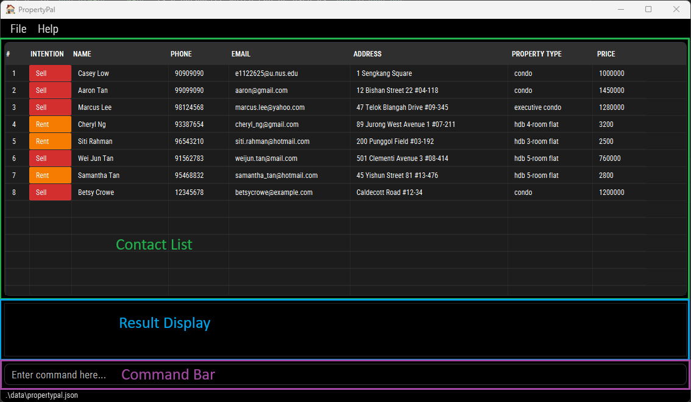
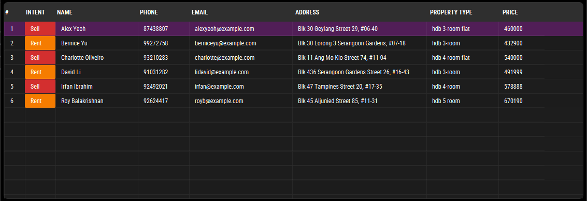
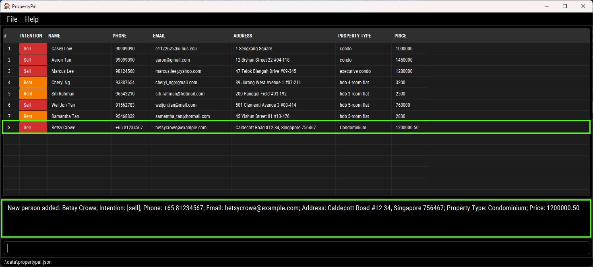
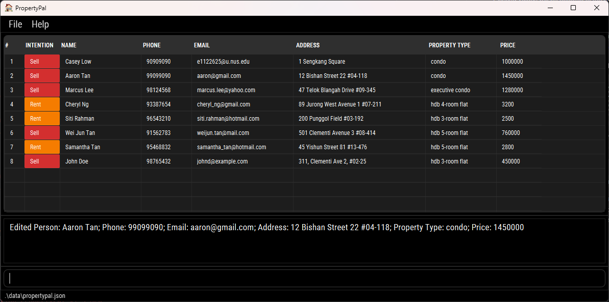
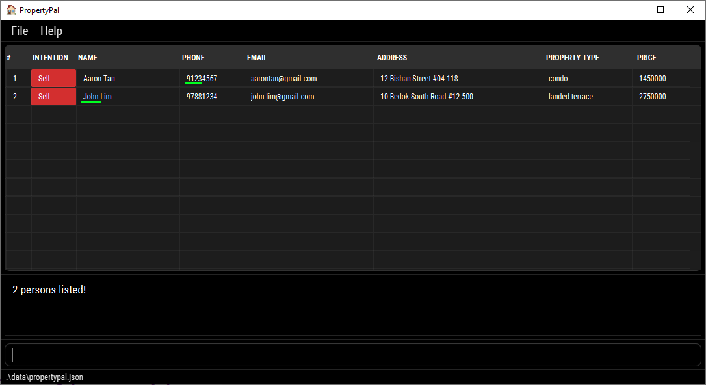
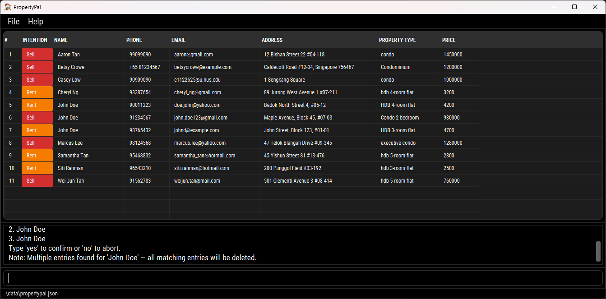

# 🏠 PropertyPal User Guide

PropertyPal is a **desktop application** that helps **real estate agents** manage their client information and preferences efficiently. It offers tools to **store**, **search**, and **organize** client information — such as names, contact details, preferred areas, and property types — all in one place.

<!-- * Table of Contents -->
<page-nav-print />

--------------------------------------------------------------------------------------------------------------------

## Quick start

1. Ensure you have Java `17` or above installed on your computer.  Java 17 can be downloaded from [here](https://www.oracle.com/java/technologies/downloads/#java17). Make sure that you choose the correct Operating System. 
   **Mac users:** Ensure you have the precise JDK version prescribed [here](https://se-education.org/guides/tutorials/javaInstallationMac.html).

2. Download the latest `.jar` file from [here](https://github.com/AY2526S1-CS2103-F10-2/tp/releases).

3. Create a new empty folder at a location of your choice on your computer.

4. Copy the file to the folder you created in step 3 to use as the _home folder_ for your PropertyPal.

5. Open a command terminal, navigate into the folder you put the jar file in, and use the `java -jar PropertyPal.jar` command to run the application. 
   A GUI should appear in a few seconds. Refer to [UI](#ui) below for more details. Note that the app contains some sample data by default. **Alternatively**, you may also double-click the jar file to run the application (depending on your OS settings).

6. Type the command in the command box and press Enter to execute it. e.g. typing **`help`** and pressing Enter will open the help window. 
   Some example commands you can try:

    * `list` : Lists all contacts.

    * `add i/sell n/John Doe p/98765432 e/johnd@example.com a/John street, block 123, #01-01 pt/HDB 3 room flat pr/470000` : Adds a contact named `John Doe` to PropertyPal, with the intention to sell his property.

    * `delete 3` : Deletes the 3rd contact shown in the current list.

    * `clear` : Deletes all contacts.

    * `exit` : Exits the app.

7. Refer to the [Features](#features) below for details of each command.

--------------------------------------------------------------------------------------------------------------------

## UI

 
The application has a Graphical User Interface (GUI) with the following components:
1. Contact List: Displays the list of persons stored in PropertyPal.
2. Result Display: Shows the outcome of user commands, such as success or error messages.
3. Command Box: The text input field where users can type commands to interact with PropertyPal.

### Contact List
 
* The Contact List displays all persons stored in PropertyPal. Each entry shows the person's intention, name, phone number, email, address, property type, and price. Each field has its own column.
* Users can adjust column widths by dragging the edges of the column headers. This helps with dealing with long values that may get cut off.
* Users can reorder columns by dragging and dropping the column headers to their desired positions.
* Clicking a row highlights it, making it easier for users to focus on a particular contact.

--------------------------------------------------------------------------------------------------------------------

## Field Validation Rules

All fields in PropertyPal are **case-insensitive** — searches and comparisons ignore case, but entries are displayed exactly as entered by the user.

| **Field**                 | **Validation Rules**                                                                                                                                                                                                                                                                                                      | **Valid Examples**                                                        | **Invalid Examples**                                         |
| ------------------------- |---------------------------------------------------------------------------------------------------------------------------------------------------------------------------------------------------------------------------------------------------------------------------------------------------------------------------|---------------------------------------------------------------------------|--------------------------------------------------------------|
| **Intention (`i/`)**      | Must be either `sell` or `rent`.                                                                                                                                                                                                                                                                                          | `i/sell`, `i/rent`, `i/Rent`                                              | `i/selling`, `i/lease`                                       |
| **Name (`n/`)**           | Must start with a letter and contain only letters, numbers, accents, spaces, periods, apostrophes, or hyphens.                                                                                                                                                                                                            | `n/John Doe`, `n/Anne-Marie Tan`, `n/O’Connor`, `n/José Álvarez`          | `n/@John`, `n/  `, `n/#Peter`                                |
| **Phone (`p/`)**          | May begin with a `+`, followed by digits, spaces, or dashes. Must contain at least **7 digits total**.                                                                                                                                                                                                                    | `p/98765432`, `p/+65 9123 4567`, `p/123-4567`                             | `p/12-34`, `p/abc123`, `p/++6598765432`                      |
| **Email (`e/`)**          | Must follow the format `<local-part>@<domain>`. The local part may contain alphanumeric characters and `.`, `_`, `+`, or `-` (not starting/ending with them). The domain must consist of labels separated by `.` that each start and end with an alphanumeric character, with the final label at least 2 characters long. | `e/johndoe@example.com`, `e/casey_low@yahoo.com.sg`, `e/user123@gmail.com` | `e/@gmail.com`, `e/user@@mail.com`, `e/john@`, `e/john@.com` |
| **Address (`a/`)**        | Cannot be blank or start with a whitespace. May contain any characters after the first non-space.                                                                                                                                                                                                                         | `a/Blk 425, Clementi Ave 1 #03-45 120425`, `a/12 Bishan St 22`            | `a/ ` (blank), `a/   45 Clementi` *(starts with space)*      |
| **Property Type (`pt/`)** | Up to 100 characters, cannot be blank or start with a space.                                                                                                                                                                                                                                                              | `pt/HDB 3 room flat`, `pt/Condominium`, `pt/Landed house`                 | `pt/ `, `pt/` (blank)                                        |
| **Price (`pr/`)**         | Must be a positive number ≤ 13 digits, optionally with commas and up to **2 decimal places**. Cannot be blank or contain symbols other than commas or one decimal point. Commas should be placed correctly (like 1,000 or 100,000).                                                          | `pr/450000`, `pr/1,200,000`, `pr/4700.50`                   | `pr/-5000`, `pr/$2000`, `pr/1,000.000`, `pr/`, `pr/100,00,0` |

<box type="info" seamless>

**Note:** PropertyPal is designed under the assumption that all properties belong to a single country.
This reflects common industry practices, as property agents are generally licensed to handle transactions only within their national jurisdiction and currency.
Thus, all property prices entered in PropertyPal are assumed to be in the same currency of the country where the agent operates.

</box>

--------------------------------------------------------------------------------------------------------------------

## Features

<box type="info" seamless>

**Notes about the command format:** 

* Words in `UPPER_CASE` are the parameters to be supplied by the user. 
  e.g. in `add n/NAME`, `NAME` is a parameter which can be used as `add n/John Doe`.

* Items in square brackets are optional. 
  e.g `n/NAME [e/EMAIL]` can be used as `n/John Doe e/johndoe@example.com` or as `n/John Doe`.

* Items in square brackets with `…`​ after them can be used multiple times including zero times. 
  e.g. `[pt/PROPERTY_TYPE]…​` can be used as ` ` (i.e. 0 times), `pt/condo`, `pt/condo pt/hdb` etc.

* Parameters can be in any order. 
  e.g. if the command specifies `n/NAME p/PHONE_NUMBER`, `p/PHONE_NUMBER n/NAME` is also acceptable.

* Extraneous parameters for commands that do not take in parameters (such as `help`, `list`, `exit` and `clear`) will be ignored. 
  e.g. if the command specifies `help 123`, it will be interpreted as `help`.

* The `find` command now supports prefix-based searches (`n/`, `p/`, `e/`, `a/`, `i/`, `pt/`, `pr/`) instead of plain keywords.
  Prefixes specify which fields to search in. For example, `find n/Alex e/gmail` searches by name and email.

* If you are using a PDF version of this document, be careful when copying and pasting commands that span multiple lines as space characters surrounding line-breaks may be omitted when copied over to the application.
  </box>

* The `INTENTION` parameter in the `add` and `find` commands refers to the client's intention regarding property transactions: selling or renting. This helps in categorizing clients based on their property-related goals.
    * **Accepted values:** `sell` or `rent` (case-insensitive). Inputs are accepted in any case and will be normalized to lowercase internally (e.g., `Sell`, `SELL`, and `sell` are all valid and stored as `sell`). Other values, abbreviations, or synonyms are not accepted.

### Viewing help : `help`

Shows a message explaining how to access the help page.

Format: `help`

### Adding a person: `add`

Adds a person to PropertyPal.

* A warning will be displayed if there already exists an entry with the same name and/or address in PropertyPal. However, it will still be accepted if at least 1 field is different from the existing entry.
* An input that is fully identical to an already existing entry is considered a duplicate and will not be accepted by PropertyPal.

Format: `add i/INTENTION n/NAME p/PHONE_NUMBER e/EMAIL a/ADDRESS pt/PROPERTY_TYPE pr/PRICE​`

Examples:
* `add i/rent n/John Doe p/98765432 e/johnd@example.com a/John street, block 123, #01-01 pt/HDB 3 room flat pr/4700`
* `add i/sell n/Betsy Crowe e/betsycrowe@example.com a/Caldecott Road #12-34, Singapore 756467 pt/Condominium pr/1200000.50 p/+65 81234567`

### Listing all persons : `list`

Shows a list of all persons in PropertyPal in alphabetical order.

For persons with duplicate fields, they will be sorted alphabetically or lexicographically based on phone number, address and email.

Format: `list`

### Editing a person : `edit`

Edits an existing person in PropertyPal.

Format: `edit INDEX [i/INTENTION] [n/NAME] [p/PHONE_NUMBER] [e/EMAIL] [a/ADDRESS] [pt/PROPERTY_TYPE] [pr/PRICE]`

* Edits the person at the specified `INDEX`. The index refers to the index number shown in the displayed person list. The index **must be a positive integer** 1, 2, 3, …​
* At least one of the optional fields must be provided.
* Existing values will be updated to the input values.

Examples:
*  `edit 2 p/99099090 e/aaron@gmail.com` Edits the phone number and email address of the 2nd person to be `99099090` and `aaron@gmail.com` respectively.
    * A prompt showing the edited contact with the new information will be displayed. (e.g. `Edited Person: Aaron Tan; Intention: [sell]; Phone: 99099090; Email: aaron@gmail.com; Address: 12 Bishan Street 22 #04-118; Property Type: condo; Price: 1450000`)
      

### Locating persons by prefix: `find`

Finds persons whose name, phone, email, address, intention, property type, or price contain any of the given keywords.
Apart from the price field, the search uses substring matching (e.g. `ali` matches `Alice`).

Format: `find [i/INTENTION]…​ [n/NAME]…​ [p/PHONE_NUMBER]…​ [e/EMAIL]…​ [a/ADDRESS]…​ [pt/PROPERTY_TYPE]…​ [pr/PRICE]…​`

* At least one prefix must be provided.
* You may include multiple prefixes in the same command — results are combined using OR semantics (a person matches if any field matches).
* Words separated by spaces are considered separate keywords.
* Parameters can appear in any order.
* The order of the keywords does not matter. e.g. `Hans Bo` will match `Bo Hans`.
* Persons matching **at least one given keyword** will be returned. Each keyword is separated by a space.
  e.g. `find n/Alice Casey` will return `Alice Tan`, `Casey Low` as results in the contact list.
    

* Finding by Price:
    * finding with an **exact value** (e.g. `pr/2000`) will return contacts who match that exact value.
    * finding with a **range of values** (e.g. `pr/2000-3000`) will return contacts who fall within the range of values specified (inclusive).

Examples:
* `find n/Alex` — finds persons whose name contains “alex”.
* `find n/John p/9123` — finds persons whose name, phone match any of the given keywords. 
  

### Deleting a person : `delete`

Deletes the specified person from PropertyPal.

Format: `delete INDEX` or `delete n/NAME [n/NAME]…`

* Deletes a single person at the specified `INDEX`, OR one or more persons by exact `NAME`(s). Do not mix index and names in the same command.
* The index refers to the index number shown in the displayed person list. The index must be a positive integer: 1, 2, 3, …

+ Deletion by name:
    + When providing a `NAME` to delete (e.g., `delete n/John Doe`), PropertyPal will match and delete **all** persons whose full name exactly matches `John Doe` (case-insensitive). If the name matches multiple entries, the application will display a confirmation warning listing all matched entries and append a note such as:
        +  `Note: Multiple entries found for 'John Doe' — all matching entries will be deleted.`
        +  You can then type `yes` to confirm or `no` to abort. 
           
    + If any given name is not found, nobody is deleted and an error listing the missing names is shown.

Examples:
* `list` followed by `delete 2` deletes the 2nd person in PropertyPal.
* `find n/Betsy` followed by `delete 1` deletes the 1st person in the results of the `find` command.
* `delete n/John Doe` deletes the person named John Doe.
* `delete n/John Doe n/Jane Smith` shows a confirmation message listing both persons; re-run with `yes` to proceed.

### Clearing all entries : `clear`

Clears all entries from PropertyPal.

Format: `clear`

### Exiting the program : `exit`

Exits the program.

Format: `exit`

### Saving the data

PropertyPal data are saved in the hard disk automatically after any command that changes the data. There is no need to save manually.

### Editing the data file

PropertyPal data are saved automatically as a JSON file `[JAR file location]/data/propertypal.json`. Advanced users are welcome to update data directly by editing that data file.

<box type="warning" seamless>

**Caution:**
If your changes to the data file makes its format invalid, PropertyPal will discard all data and start with an empty data file at the next run.  Hence, it is recommended to take a backup of the file before editing it. 
Furthermore, certain edits can cause the PropertyPal to behave in unexpected ways (e.g., if a value entered is outside the acceptable range). Therefore, edit the data file only if you are confident that you can update it correctly.
</box>

--------------------------------------------------------------------------------------------------------------------

## FAQ

**Q**: How do I transfer my data to another Computer? 
**A**: Install the app in the other computer and overwrite the empty data file it creates with the file that contains the data of your previous PropertyPal home folder.

--------------------------------------------------------------------------------------------------------------------

## Known issues

1. **When using multiple screens**, if you move the application to a secondary screen, and later switch to using only the primary screen, the GUI will open off-screen. The remedy is to delete the `preferences.json` file created by the application before running the application again.
2. **If you minimize the Help Window** and then run the `help` command (or use the `Help` menu, or the keyboard shortcut `F1`) again, the original Help Window will remain minimized, and no new Help Window will appear. The remedy is to manually restore the minimized Help Window.

--------------------------------------------------------------------------------------------------------------------

## Command summary

Action     | Format, Examples
-----------|----------------------------------------------------------------------------------------------------------------------------------------------------------------------
**Add**    | `add i/INTENTION n/NAME p/PHONE_NUMBER e/EMAIL a/ADDRESS pt/PROPERTY_TYPE pr/PRICE​`   e.g., `add i/sell n/James Ho p/22224444 e/jamesho@example.com a/123, Clementi Rd, 1234665 pt/HDB 3 room flat pr/470000`
**Clear**  | `clear`
**Delete** | `delete INDEX` or `delete n/NAME [n/NAME]…`  e.g., `delete 3` or `delete n/John Doe n/Jane Smith` followed by `yes`
**Edit**   | `edit INDEX [n/NAME] [p/PHONE_NUMBER] [e/EMAIL] [a/ADDRESS] [pt/PROPERTY_TYPE] [pr/PRICE]`  e.g.,`edit 2 n/James Lee e/jameslee@example.com`
**Find**   | `find [i/INTENTION]…​ [n/NAME]…​ [p/PHONE_NUMBER]…​ [e/EMAIL]…​ [a/ADDRESS]…​ [pt/PROPERTY_TYPE]…​ [pr/PRICE]…​`  e.g., `find n/James p/9876 e/gmail a/Clementi`
**List**   | `list`
**Help**   | `help`
